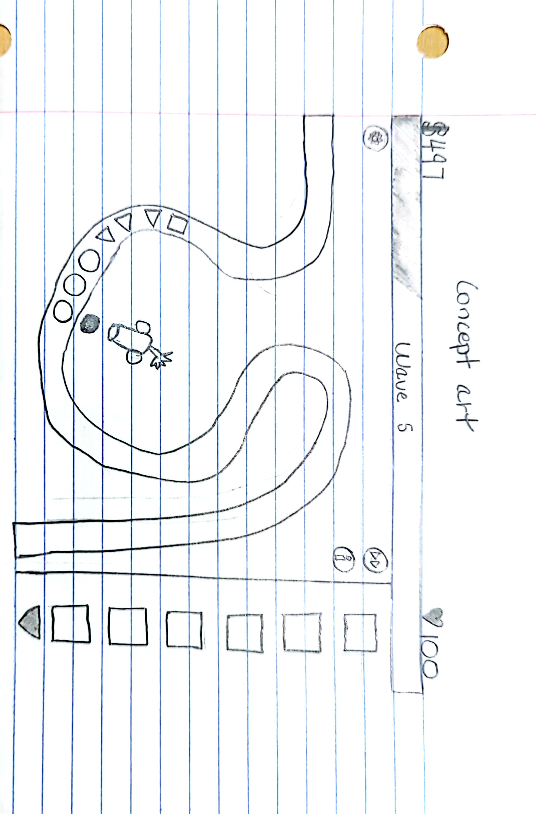
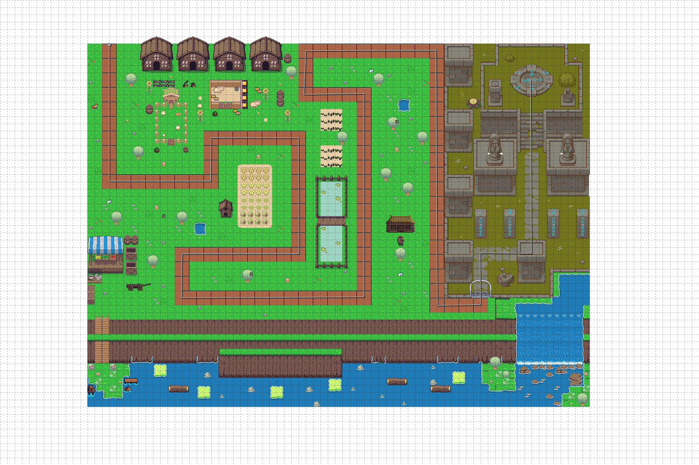

:warning: Everything between << >> needs to be replaced (remove << >> after replacing)

# baboons vs balloons 
## CS110 Final Project fall, 2023 

## Team Members

*** Jay Shi, Scott Mcstay 

## Project Description

A tower defense game where balloons follow a set path and the the baboons need to attack and stop them from making it to the exit 

***    

## GUI Design

### Initial Design

### Final Design

## Program Design

### Features

1. Menu where user can ready up and start the game  
2. an interactive map that stops players from placing on the track 
3. the abilty to upgrade and deal more damage/range/attack speed
4. wave system 
5. differnt balloon types 

### Classes

- << You should have a list of each of your classes with a description >>

## ATP

|Step| Action  | Result |
|-|------------- | ------------- |
|1| Press Space key | updates from menu screen into game screen  |
|2| Content Cell  | Content Cell  |
