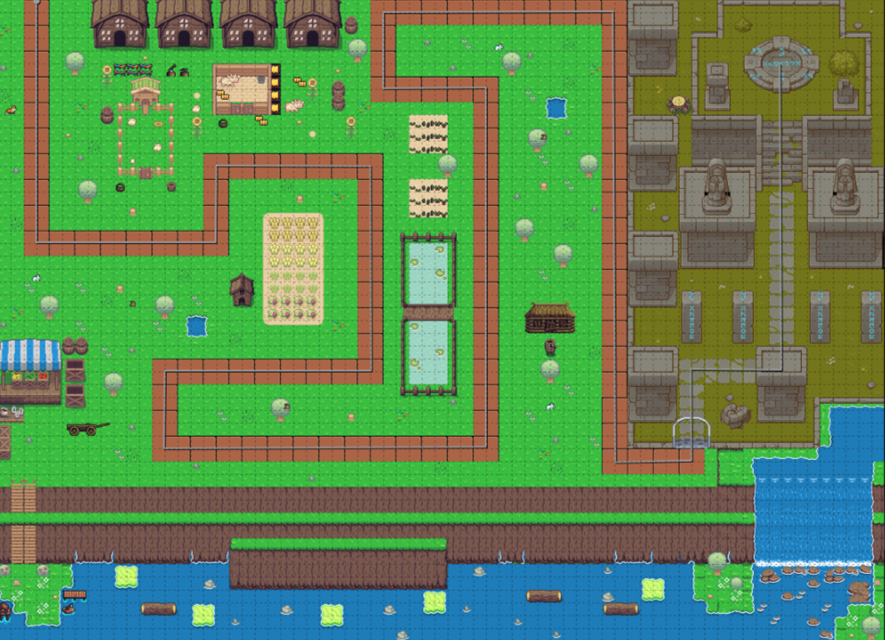

:warning: Everything between << >> needs to be replaced (remove << >> after replacing)

# baboons vs balloons 
## CS110 Final Project fall, 2023 

## Team Members

*** Jay Shi, Scott Mcstay 

## Project Description

A Tower Defense Style game but with endless waves. Place monkeys as you attempt to defend your castle from the endless balloon onslaught

***    

## GUI Design

### Initial Design

### Final Design

## Program Design

### Features

1. Menu where user can ready up and start the game  
2. ability to place down attacking troops
3. monkeys deal damage to balloons and if balloon health = 0 the balloon is killed 
3. differnt balloon types 
4. balloons follow a set track 
5. balloons disapear when reach the end of the track

### Classes

- Enemy Class 
    -creates and manages movement for the enemy ballon types
- Monkey Class
    - handles the spawning and targerting of all towers the user places while preventing overlapping of towers
- World Class 
    -loads, scales, and draws the background of the maps while also randomizing the order in which balloons appear in each wave
- Constants Class
    - stores the data for variables that remain constant 

## ATP

|Step| Action  | Result |
|-|-----------------| --------------                             |
|1| Press Space key | updates from menu screen into game screen  |
|2| wait for balloon to reach the end of the track | Balloon follows the set track and is killed once end of track is reached|
|3| click on the screen near the track| places a monkey |
|4| wait for balloons to reach monkeys range| monkey shoots at the balloon farthest along the track within its range |
|5| wait for monkey to shoot red balloon multuiple times  | the red balloon gets popped after only 2 shots|
|6| wait for monkey to shoot grey balloon| monkey needs to shoot 5 times to pop it|
